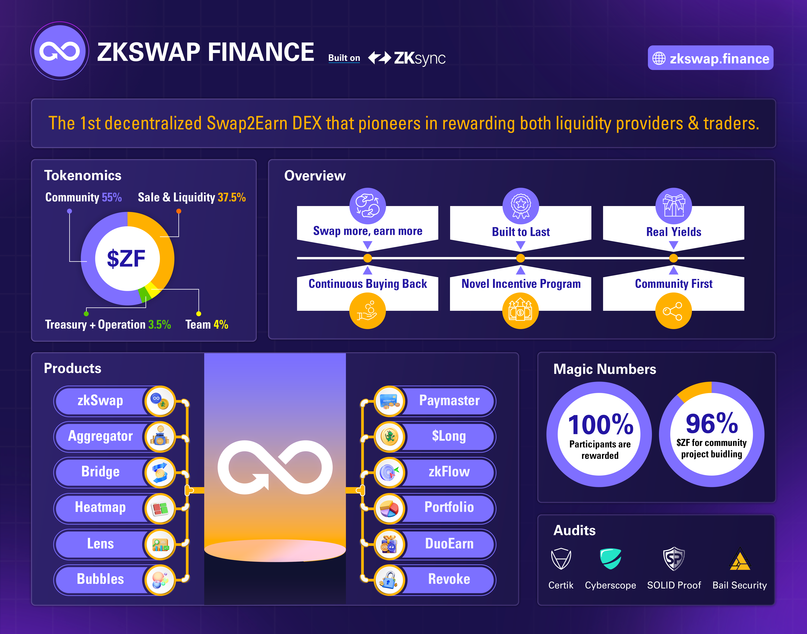

# 👋 Introduction

**zkSwap Finance is a leading multichain DEX and the first Swap2Earn DeFi platform, pioneering an incentive model that rewards both liquidity providers and traders**

Originally launched on zkSync Era (Ethereum Layer 2), zkSwap has since expanded across multiple blockchain networks, with more integrations continually underway. We offer a novel and imaginative DeFi experience where every contribution is recognized. Our platform is built around user-centric features and a strong commitment to sustainable ecosystem growth across all supported chains.

We encourage you to read our [Ethos & Value](https://docs.zkswap.finance/resources/about-us) to learn more about our commitments.

<figure><figcaption></figcaption></figure>

### Earn zkSwap Finance token $ZF with any of the following activities:

* [Swap2Earn](highlights/swap2earn.md)
* [Farm2Earn](highlights/farm2earn.md) (Liquidity Providing)
* [Affiliate | Referral Program](highlights/affiliate-or-referral-program.md)
* Incentive Campaigns
* Support Project via social channels.

### zkSwap Finance Magic Numbers:

* 100% of Participants are rewarded.
* 96% of the total token supply is allocated to the community and project development.
* 75% of the profit generated by the protocol is used for buying back or redistributing to the holders.
* The majority of the trading fee is redistributed to the liquidity providers.

### Join the zkSwap Finance community!

* **Website:** [**https://zkswap.finance/**](https://zkswap.finance/)
* **Twitter:** [**https://twitter.com/zkSwap\_finance**](https://twitter.com/zkSwap_finance)
* **Debank:** [**https://debank.com/official-account/111776**](https://debank.com/official-account/111776)
* **Discord:** [**https://discord.gg/zkswap-finance**](https://discord.gg/zkswap-finance)
* **Telegram:** [**https://t.me/zkSwap\_Announcement**](https://t.me/zkSwap_Announcement)
* **Linktree:** [**https://linktr.ee/zkswap\_finance**](https://linktr.ee/zkswap_finance)

