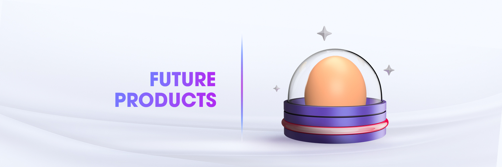

# Future Product

<figure><figcaption></figcaption></figure>

ZkSwap is continuously working on developing and launching new DeFi products to enhance its ecosystem. We are currently considering several upcoming products, which may include (but are not limited to):

* [ ] **Voting:** Users can submit and vote on proposals, creating a decentralized decision-making process such as directing zkSwap direction to align with the need of its community & continue to provide value to its user
* [ ] **StableSwap:** a stablecoin exchange protocol that eliminates impermanent loss and reduces slippage.
* [ ] **Launchpad:** Select and introduce quality and potential projects to our valuable community
* [ ] **Vault:** allow users to easily manage their crypto assets and maximize their returns through automated yield strategies.
* [ ] **Aggregator:** combines liquidity from multiple sources to offer users the best possible price on their trades

All of these aim to address various challenges in the DeFi space and offer innovative solutions & provide a diverse range of options to users, making zkSwap a one-stop-shop for all their DeFi needs.
