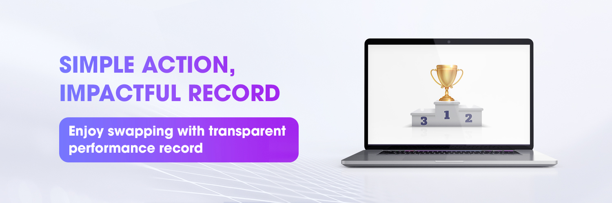

# 💡 Swap2Earn

<figure><figcaption></figcaption></figure>

### 1. Overview

The **Swap2Earn** offered by zkSwap Finance is a unique and distinctive feature that encourages users to engage with our platform, creating a competitive atmosphere for traders and honoring ALL user participation.

Our motto is "the more you contribute, the more rewards you receive." The [SwapBoard ](https://zkswap.finance/swapboard)tracks all trading activities on the platform and rewards all participants accordingly. Activities are consolidated in a personalized dashboard.


Remember to Register for the [Swap2Earn ](https://zkswap.finance/swapboard)campaign. Register only once for a lifetime


Scoring Structure:

<table><thead><tr><th width="213.33333333333331">Acitivity</th><th>Description</th></tr></thead><tbody><tr><td>Swapping</td><td><ul><li>Swap 1$ = 1 ZFPoint * Your Boost</li><li>Max ZFPoint: Unlimited</li></ul></td></tr><tr><td>Invitation Mission</td><td><ul><li>20% of all invitees ZFPoint during active cycle </li><li>5% for lifetime</li><li>Max referral: Unlimited</li></ul></td></tr></tbody></table>


Your Boost = 1 + 300 \* (Your staked ZF in the DAO Pool)/(Total ZF Supply)


### Cycle

Each cycle starts on the 1st and 16th of each month and ends just before the beginning of a new cycle.&#x20;

To ensure a level playing field, the rankings and ZFPoint will be reset automatically at the end of each cycle. This gives all users an equal opportunity to earn rewards every cycle.

### Reward:

Total Reward: The total reward for the Swap2Earn is 20% (200.000.000 $ZF) of the total supply over 3 years.

Cycle rewards are determined by time and emission rate, and distributed proportionally based on zkSwap ZFPoint.

Claim Time: rewards are distributed on the 1st and 16th of every month and can be claimed at [https://zkswap.finance/earn/rewards](https://zkswap.finance/earn/rewards)

Here is how the reward amount is calculated:

$$
yourCycleReward = (yourCyclePoint/totalCyclePoint) * cycleTotalReward
$$

### How To Participate **Swap2Earn**&#x20;

* Access to [https://zkswap.finance/swapboard](https://zkswap.finance/swapboard)
* Click "Register" Button and create your profile ([tutorial](broken-reference))

### **Example**:

<table><thead><tr><th></th><th width="249.33333333333331"></th><th></th></tr></thead><tbody><tr><td>Cycle</td><td>1</td><td>2</td></tr><tr><td>Your Swap Volume</td><td>$100</td><td>$100</td></tr><tr><td>Your Boost</td><td>1x</td><td>2x</td></tr><tr><td>Your Cycle ZFPoint</td><td>100</td><td>200</td></tr><tr><td>Total Cycle ZFPoint</td><td>2000</td><td>2000</td></tr><tr><td>Your Reward Percent </td><td>5%</td><td>10%</td></tr><tr><td>Total Cycle Reward</td><td>10000 $ZF</td><td>10000 $ZF</td></tr><tr><td>Your Reward</td><td>500 $ZF</td><td>1000 $ZF</td></tr></tbody></table>
