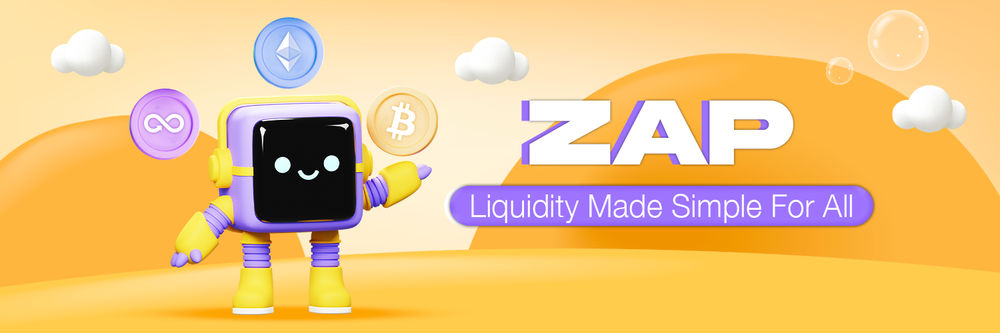

# ⚡ ZAP

<figure><figcaption></figcaption></figure>

**ZAP** is zkSwap Finance's smart liquidity tool that allows users to add or remove liquidity with just a **single token**, eliminating the complexity of ratio management and multi-step transactions.

Whether you're adding liquidity to a **Classic Pool (V2)** or a **Concentrated Liquidity Pool (V3)**, ZAP streamlines the process into a single, efficient, and gas-optimized transaction.

## 🎯 ZAP for Concentrated Liquidity Pools (V3)

Adding liquidity to Uniswap v3-style pools is complex due to custom ranges and imbalanced ratios. ZAP V3 solves this via KyberSwap's Zap API and Aggregator, designed for real-time optimization.

### Zap In — Add Liquidity to a V3 Range with One or Several Arbitrary Token

* Input any amount of a single token (e.g., 5,000 USDT).
* ZAP uses KyberSwap's off-chain aggregator to simulate optimal swap routes.
* On-chain, the system rechecks the pool state before execution to adjust for slippage or price drift.
* Tokens are added at the right ratio into your selected price range.
* You receive a Liquidity Position NFT.

**Example:** You want to add to the ZK-USDC pool, but only have ETH. ZAP converts a portion of your ETH into ZK and another portion into USDC based on your price range settings. Then ZAP adds the pair into the pool in the correct proportions and return the Liquidity Position NFT back to you.

### Zap Out — Withdraw to One Token

* Choose one token to withdraw your position into (e.g., only ZK).
* ZAP auto-converts all assets from your NFT position to your chosen token.

### Built-In Safety

* Slippage Protection: Reverts if swap output is too low.
* Min Liquidity Check: Reverts if added liquidity doesn't meet expectations.

### Benefits

* 🧠 Handles complex liquidity logic behind the scenes
* 🤖 Adaptive on-chain rebalancing at execution time
* 🔁 Eliminates leftover or idle tokens
* ⚡ Powered by KyberSwap’s Aggregator and Zap API

## 🌀 Zap for Classic Pools (V2 Pools)

Classic (V2-style) pools require liquidity to be added in a **50/50 ratio** between both tokens in a pair. ZAP simplifies this with:

### **Zap In – Add Liquidity with One Token**

* Add liquidity using just one token (e.g. USDC).
* ZAP automatically swaps half of it into the paired token.
* Adds both tokens into the pool at a 50:50 ratio.
* Returns your LP tokens to your wallet.

**Example:** You want to add to the USDC-ETH pool, but only have USDC. ZAP converts a portion of your USDC into ETH and adds the pair into the pool in the correct proportions.

### **Zap Out – Withdraw and Receive One Token**

* Remove liquidity and choose to receive a single token.
* ZAP converts both sides of your LP tokens into your chosen token (e.g. only USDC).
* Helps avoid unwanted assets and reduces post-withdrawal swap steps.

### Benefits

* 💡 Simple UI, single transaction
* ⛽ Fewer gas fees
* 🧠 No need to calculate token ratios manually
* 🔁 Powered by **Odos.xyz** aggregator for best swap routes

**ZAP** facilitates the uncomplicated adding or removal of liquidity, allowing users to specify the amount of desired tokens they wish to add or receive.

Enhancing user experience remains a central focus for all zkSwap Finance products, and ZAP represents a novel feature designed to make liquidity provision more accessible, particularly for those new to the DeFi landscape. This update aims to attract a broader user base to zkSwap Finance, allowing them to explore the intricacies of DeFi effortlessly.
