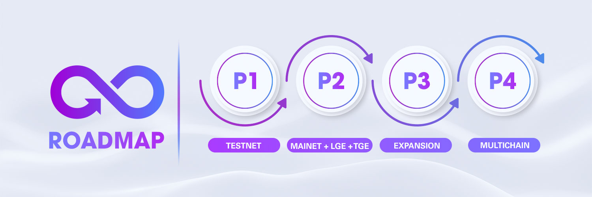

# 🗺️ Roadmap

<figure><figcaption></figcaption></figure>

Welcome to zkSwap Finance roadmap! This document outlines the primary steps in our plans, providing a main trajectory for our collective efforts. It's important to note that this roadmap is a flexible guide, and revisions may be made as needed. We value adaptability and welcome any adjustments that will contribute to the success of our project. Let's embark on this journey together, confident in our ability to navigate and refine our path to success.

### **PHASE 1:** DEVELOPMENT & TESTING

In the first stage, the zkSwap Finance team dedicates its efforts to the creation and rigorous testing of the Swap2Earn protocol. This encompasses the formulation and execution of fundamental smart contracts, the construction of the user interface, and the execution of comprehensive security aimed at detecting and rectifying any potential vulnerabilities.

* [x] Core team assembled
* [x] Brainstorming innovative ideas&#x20;
* [x] Crafting a sustainable economic model&#x20;
* [x] Designing incentive programs for liquidity providers and holders to drive adoption.&#x20;
* [x] Creating a long-term tokenomics strategy for generations to come.&#x20;
* [x] Introducing a grand marketing program to showcase our vision to the world.
* [x] Web App Development
  * [x] Decentralized Exchange
  * [x] Integrate Swap-to-Earn
  * [x] SwapBoard
  * [x] Affiliate | Referral Program
  * [x] Sharing Program
  * [x] Daily Checkin Bonus
  * [x] Testnet Faucet
* [x] Partnership Engagement
* [x] Launch on zkSync Testnet
* [x] Community Growth
* [x] Open Alpha Testing Phase (Competition Cycle 0)
* [x] Open Beta Testing Phase
* [x] Improved UX & UI
* [x] Preparing Mainnet Launching

### **PHASE 2: LAUNCHING**

Following the development and testing phase, zkSwap Finance deploys the Swap2Earn protocol on zkSync Era, allowing users to contribute liquidity and participate in various activities associated with the official launch. Active community participation enables users to accumulate contributions and qualify for the $ZF airdrop.

* [x] Smart Contract Audit
* [x] Official Launch zkSwap on Mainnet
* [x] Web App Development
  * [x] Bridge Page
  * [x] Earn Page
  * [x] Launchpad Page
  * [x] Farming & Staking
  * [x] Vesting Mechanism
  * [x] Swap-to-Earn Campaign
  * [x] Analytics Page
  * [x] Governance
  * [x] zkFlow-v1
  * [x] zkBridge-v1
* [x] Partner with zkSync ecosystem projects
* [x] zkSwap Liquidity Generation Event (LGE)
* [x] zkSwap Token Generation Event (TGE)
* [x] Start Competition Campaign
* [x] Launch Farming & Staking&#x20;
* [x] More & More Farming Pools
* [x] Retroactive Trading Rewards&#x20;
* [x] Community-Driven Rewards&#x20;
* [x] Enhance UI & UX for zkBridge
* [x] More & More Partnerships
* [x] Community Expansion
* [x] Improvement Earning Page UI & UX

### **PHASE 3: REPEAT EVOLUTION -> REVOLUTION**

In this phase, zkSwap continually enhances its platform by introducing diverse products, pushing the ecosystem to new heights and maintaining a leading position in blockchain innovation.

* [ ] Web App Development
  * [x] zkFlow-v2
  * [x] zkBridge-v2
  * [x] Zap In - Zap Out
  * [x] AI Live Chat Support
  * [x] ZF Paymaster (Account Abstraction)
  * [x] Dexs zkAggregator
  * [x] Strengthen frontend security
  * [x] More audits
  * [x] zkHeatmap v1
  * [ ] StableSwap
  * [ ] Integrate SwapBoard for StableSwap
  * [ ] Subsidiary product
  * [ ] Subsidiary product
  * [ ] Smart DEXs
  * [ ] Subsidiary product
  * [ ] Launchpad
  * [ ] Subsidiary product
  * [ ] Continuous Improvement UI, UX and Performance
  * [ ] Mobile App
* [x] Certik Audit
* [x] Certik KYC
* [ ] Certik Bounty
* [ ] Partner with other DEXs with Vault
* [ ] Community Expansion Campaign
* [ ] Listing on Top CEXs

### **PHASE 4: MULTICHAIN EXPANSION**

In this phase, zkSwap Finance aims to become a formidable DeFi competitor by expanding across multiple blockchains, fostering strategic partnerships for broader ecosystem integration, and continuously innovating to cater to a diverse global audience.

* [ ] Continuing to innovate and adapt services
* [ ] Web App Development
  * [ ] Expand zkSwap to multiple networks
  * [ ] Cross-chain Token, Cross-chain Swap-to-Earn

### [**Join Our Community For More Information**](../official-links.md) 

