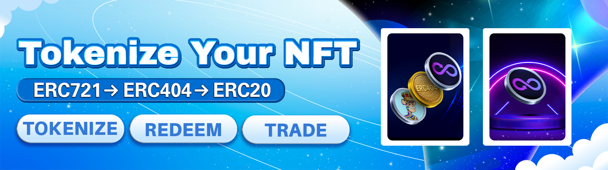

# 🇹🇰 Tokenize NFT

<figure><figcaption></figcaption></figure>

**Try it at** [**https://www.zkswap.finance/tokenize**](https://www.zkswap.finance/tokenize)

NFTs have long struggled with liquidity issues - hard to trade, illiquid markets, and limited utility beyond holding or selling. Inspired by ERC-404, our permissionless Tokenize NFT feature solves this problem by bridging the gap between ERC-721 and ERC-20 tokens.

With Tokenize NFT, you can deposit NFTs to mint ERC-20 tokens (1 per NFT) and later redeem them by burning whole tokens to receive the original NFTs. This simple yet powerful mechanism unlocks fractional trading, liquidity provision, and new yield opportunities in the DeFi ecosystem.

**Why Use Tokenize NFT:**

* **Instant Liquidity for NFTs**: Convert NFTs into ERC-20 tokens that can be freely traded, swapped, or provided as liquidity.
* **Fractional Trading**: Trade NFTs in tokenized form, making them more accessible and liquid for a broader market.
* **DeFi Ready**: Use your tokenized NFTs across DeFi protocols - swap them, provide liquidity on V2/V3, or bridge them wherever ERC-20 tokens are supported.
* **Batch Operations**: Deposit or redeem multiple NFTs at once for maximum convenience.
* **FIFO Redemption**: NFTs are redeemed in the same order they were tokenized (first-in, first-out). Example: NFTs tokenized in order #12 → #45 → #99 will be redeemed in that sequence.
* **Zero Fees on Tokenize/Redeem**: Enjoy cost-free tokenization and redemption. Only a 2 MON initialization fee is required to create a new token for a collection.
* **Flexible Token Naming**: The first tokenizer sets the name and symbol, but anyone can deploy new tokens for the same collection with different parameters.

By transforming illiquid NFTs into ERC-20 tokens, Tokenize NFT paves the way for deeper liquidity, new DeFi integrations, and innovative trading strategies—all while keeping the process simple and permissionless.
