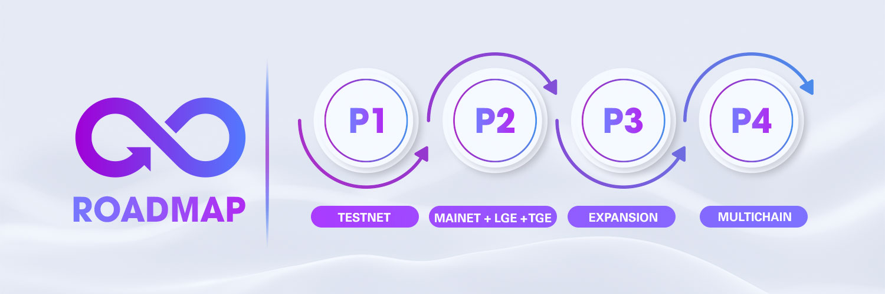

# Roadmap

<figure><figcaption></figcaption></figure>

### **PHASE 1**

* [x] Core team assembled
* [x] Brainstorming innovative ideas&#x20;
* [x] Crafting a sustainable economic model&#x20;
* [x] Designing incentive programs for liquidity providers and holders to drive adoption.&#x20;
* [x] Creating a long-term tokenomics strategy for generations to come.&#x20;
* [x] Introducing a grand marketing program to showcase our vision to the world.
* [x] Web App Development
  * [x] Decentralized Exchange
  * [x] Integrate Swap-to-Earn
  * [x] SwapBoard
  * [x] Affiliate | Referral Program
  * [x] Sharing Program
  * [x] Daily Checkin Bonus
  * [x] Testnet Faucet
* [x] Partnership Engagement
* [x] Launch on zkSync Testnet
* [x] Community Growth
* [x] Open Alpha Testing Phase (Competition Cycle 0)
* [x] Open Beta Testing Phase
* [x] Improved UX & UI
* [x] Preparing Mainnet Launching

### **PHASE 2**

* [x] Smart Contract Audit
* [x] Official Launch zkSwap on Mainnet
* [ ] Web App Development
  * [x] Bridge Page
  * [x] Earn Page
  * [x] Launchpad Page
  * [x] Farming & Staking
  * [x] Vesting Mechanism
  * [x] Swap-to-Earn Campaign
  * [x] Analytics Page
  * [ ] Governance
  * [x] zkFlow-v2
  * [x] zkBridge
* [x] Partner with zkSync ecosystem projects
* [x] zkSwap Liquidity Generation Event (LGE)
* [x] zkSwap Token Generation Event (TGE)
* [x] Start Competition Campaign
* [x] Launch Farming & Staking&#x20;
* [ ] More & More Partnerships
* [ ] Community Expansion
* [x] Retroactive Trading Rewards&#x20;
* [x] Community-Driven Rewards&#x20;

### **PHASE 3**

* [ ] Web App Development
  * [ ] Launchpad
  * [ ] StableSwap
  * [ ] Vault
  * [ ] Integrate SwapBoard for StableSwap and Vault
  * [ ] Mobile App&#x20;
* [ ] Upgrade UI, UX and Performance
* [ ] Partner with other DEX with Vault
* [ ] Community Expansion Campaign
* [ ] Listing on Top CEXs

### **PHASE 4**

* [ ] Web App Development
  * [ ] Aggregator
  * [ ] Expand zkSwap to multiple networks
  * [ ] Cross-chain Swap-to-Earn

### [**Join Our Community For More Information**](support-and-branding/support-and-collaboration.md) 

