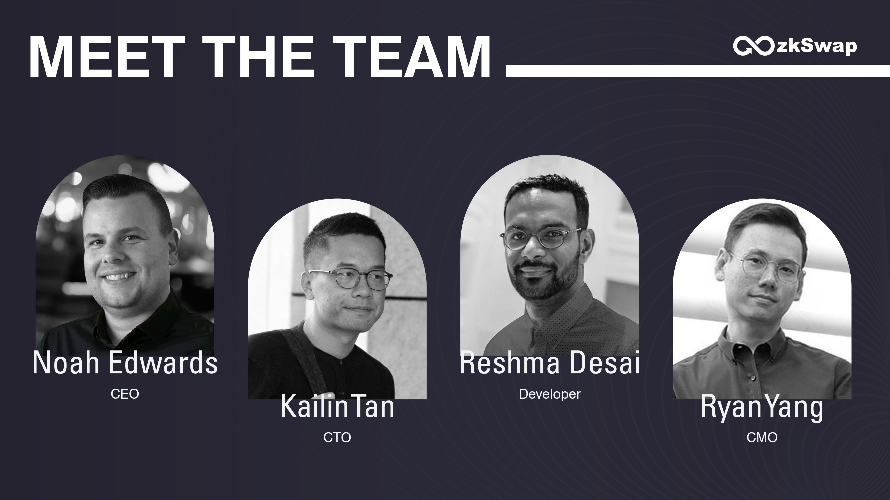

# zkSwap Team

<figure><figcaption></figcaption></figure>

#### **Founder & CEO: Noah Edwards**

* A deeply passionate advocate for blockchain technology and cryptocurrency. With an unbreakable determination and unwavering conviction, the ultimate goal is to infuse the crypto world with creativity, fairness, and transparency.
* Professional Profile: [https://beta.talentprotocol.com/u/noahedward](https://beta.talentprotocol.com/u/noahedward)

#### **CTO: Kailin Tan**

* An enthusiast of innovative technology and real-world problem solving, with a firm belief in blockchain and cryptocurrency's transformative potential for fintech's future.
* Professional Profile: [https://beta.talentprotocol.com/u/kailintan](https://beta.talentprotocol.com/u/kailintan)

#### **Developer: Reshma Desai**

* A dedicated developer with an innate ability to turn impossible challenges into tangible digital solutions, always striving to push the boundaries of innovation.
* Professional Profile: [https://beta.talentprotocol.com/u/reshmadesai](https://beta.talentprotocol.com/u/reshmadesai)

#### **CMO: Ryan Yang**

* A marketing professional experienced in both traditional finance and the crypto industry., adept at scaling projects from ideation to execution, with a strong focus on marketing.
* Professional Profile: [https://beta.talentprotocol.com/u/ryanyang](https://beta.talentprotocol.com/u/ryanyang)

#### Business Development: Christ Lang

* Driving growth through strategic partnerships and opportunities.
* Telegram: [https://t.me/zkSwap\_Christ](https://t.me/zkSwap\_Christ)

#### Community Moderator: Jenko

* Fostering a vibrant and engaged community.
* Telegram: [https://t.me/Jenko1222](https://t.me/Jenko1222)
