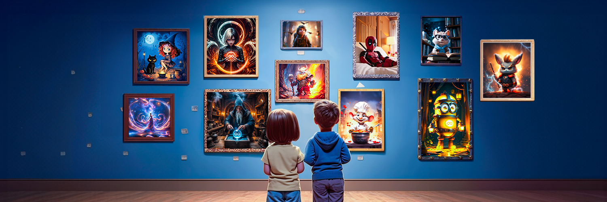

# 👬 Team (Certik KYC Silver Verified)

The 3 co-founders are KYCed and verified with a Silver Badge by the prestigious Certik.\
Details: [https://skynet.certik.com/projects/zkswap-finance](https://skynet.certik.com/projects/zkswap-finance)

<figure><figcaption></figcaption></figure>

## Ethos & Value

> "At zkSwap Finance, our mission revolves around innovation, sustainability, and transparency. We're dedicated to fostering an inclusive environment where everyone's contributions are respected and valued.&#x20;
>
> Continuous improvement is at the core of our ethos. We actively listen to and absorb feedback from our users, backers, and team members to enhance our product continually. Our aim is to develop a unique and sustainable product that stands the test of time.&#x20;
>
> Our focus lies in three key areas: innovating our protocol services, ensuring sustainability in our economic model, and maintaining transparency in our reward and operating policies. Transparency is paramount in fostering a robust community, and we're committed to fostering an open and honest environment where everyone feels informed and appreciated.&#x20;
>
> We're thrilled to extend an invitation to you to join us on this journey toward innovation, sustainability, and transparency within the zkSwap Finance protocol. Together, let's learn, build, and innovate, shaping a brighter future for all."
>
> "zkSwap Finance CEO - Ryan Yang"

<figure><figcaption></figcaption></figure>

## Team Members

#### **Founder CEO: Ryan Yang**

* A marketing professional experienced in both traditional finance and the crypto industry, adept at scaling projects from ideation to execution, with a strong focus on marketing and strategy.
* Contact: [Telegram ](https://t.me/zkSwap\_Ryan)| [Discord](https://discord.gg/4eHMumaJDA)

#### **Founder CTO: KailinKool**

* An enthusiast of innovative technology and real-world problem solving, with a firm belief in blockchain and cryptocurrency's transformative potential for fintech's future.
* Contact: [Discord](https://discord.gg/4eHMumaJDA)

#### CMO: Christ Lang

* Christ Lang leads zkSwap Finance marketing strategy, blending innovation and data to engage our audience. With a focus on trust and inclusivity, he drives adoption and community growth in the dynamic crypto space.
* Contact: [Telegram](https://t.me/zkSwap\_Christ) | [Discord](https://discord.gg/4eHMumaJDA)

#### &#x20;**Advisor & Founder: ThunderNoah**

* A pioneering founder championing blockchain and cryptocurrency, now serves as an advisor with a relentless drive for creativity, fairness, and transparency in the crypto world.&#x20;
* Contact: [Twitter](https://twitter.com/MegaBull\_Noah) | [Binance ](https://www.binance.com/en/feed/profile/Noah\_Edwards)| [Discord](https://discord.gg/4eHMumaJDA)

#### **Business Development (BD): Lucas Lee**

* Drives strategic partnerships and business expansion, leveraging his expertise to unlock new opportunities and propel growth.
* Contact: [Telegram](https://t.me/ZF\_Lucas) | [Discord](https://discord.com/users/1212659857128292442)

#### **Developer: ReshMagic**

* A dedicated developer with an innate ability to turn impossible challenges into tangible digital solutions, always striving to push the boundaries of innovation.
* Contact: [Discord](https://discordapp.com/users/1079941397890740294)

#### Front-end Developer**:** Jason Goh

* Bringing seamless user interfaces to life, combining design finesse with technical expertise.

#### Intern Developer**:** Ethan Lim

* Contributes fresh perspectives and a thirst for learning, embodying innovation and growth.

#### Content Writer**:** Hannah Tan

* Crafting engaging narratives, Hannah Tan communicates our brand message effectively through blog posts and marketing materials.

#### Designer**:** Nathan Wong

* Elevates projects with artistic vision, enhancing our brand image and user experience.

#### Community Moderator: Jenko

* Fostering a vibrant and engaged community.
* Contact: [Telegram](https://t.me/Jenko1222)

#### Artist: Ido Long

* Create the best meme for[ $Long - ZKsync Dragon Meme Coin](https://x.com/LongxFun)&#x20;

